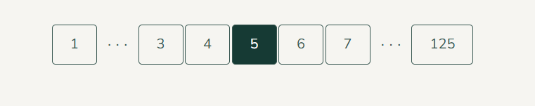

# useSimplePagination

[](https://www.npmjs.com/package/simple-pagination-hook)
[](./LICENSE)
[](https://www.npmjs.com/package/simple-pagination-hook)

A lightweight utility for generating pagination button numbers with support for fixed first/last pages, center alignment, and optional window shift. 📦 Works with React, Vue, Svelte, or vanilla JS.

## Why This Hook?

- **22x faster** than alternative implementations (see benchmarks below)
- **Zero dependencies** — pure TypeScript/JavaScript
- **Framework agnostic** — works with React, Vue, Svelte, or vanilla JS
- **Math-based approach** — O(1) complexity, scales with button count, not page count
- **Type-safe** — full TypeScript support included
- **Battle-tested** — 48 unit tests with 100% coverage

## Installation

```bash
npm install simple-pagination-hook
```

```ts
import { useSimplePagination } from "simple-pagination-hook";
```

## Quick Start

```tsx
import { useSimplePagination } from "simple-pagination-hook";

const pages = useSimplePagination(5, 100, 7);
// → [1, 3, 4, 5, 6, 7, 100]
```

## API

```ts
useSimplePagination(
  currentPage: number,
  totalPages: number,
  visibleButtons: number,
  shift?: number
): number[]
```

### Parameters

| Name             | Type     | Default | Description                                                                                      |
| ---------------- | -------- | ------- | ------------------------------------------------------------------------------------------------ |
| `currentPage`    | `number` | –       | Current page number (**1-based**). For page 1 use `1`, for page 2 use `2`, etc.                  |
| `totalPages`     | `number` | –       | Total number of pages available.                                                                 |
| `visibleButtons` | `number` | –       | Number of buttons to display (including first and last). **Minimum: 5** (auto-adjusted if less). |
| `shift`          | `number` | `0`     | Window centering offset. Positive → more left, negative → more right.                            |

## Returns

Returns an array of **1-based page numbers** for display, e.g. `[1, 5, 6, 7, 50]`.

Always includes:

- First page (`1`)
- Dynamic window around current page
- Last page (`totalPages`)

## Examples

### Basic Usage

```ts
useSimplePagination(1, 125, 7);
// Page 1 → [1, 2, 3, 4, 5, 6, 125]

useSimplePagination(61, 125, 7);
// Page 61 → [1, 59, 60, 61, 62, 63, 125]

useSimplePagination(121, 125, 7);
// Page 121 → [1, 119, 120, 121, 122, 123, 125]
```

### With Shift

```ts
useSimplePagination(10, 50, 7, 0); // Default
// → [1, 8, 9, 10, 11, 12, 50]

useSimplePagination(10, 50, 7, 1); // Shift left
// → [1, 7, 8, 9, 10, 11, 50]

useSimplePagination(10, 50, 7, -1); // Shift right
// → [1, 9, 10, 11, 12, 13, 50]
```

### Edge Cases

```ts
useSimplePagination(1, 1, 7); // → [1]
useSimplePagination(1, 0, 7); // → []
useSimplePagination(5, 20, 3); // ⚠️ Auto-adjusted to 5 buttons
// → [1, 5, 6, 7, 20]
⚠️ Even if `visibleButtons` is smaller than 5, the hook auto-adjusts to keep first and last pages, plus a minimal window of at least 5 buttons.


// If currentPage > totalPages:
useSimplePagination(30, 10, 7);
// → [1, 5, 6, 7, 8, 9, 10]
```

### **Usage Example (React)**

```tsx
import { useSimplePagination } from "simple-pagination-hook";

function Pagination({ currentPage, totalPages, onPageChange }) {
  const pages = useSimplePagination(currentPage, totalPages, 7);

  return (
    <nav>
      {pages.map((page, idx) => {
        const hasGap = idx > 0 && page - pages[idx - 1] > 1;

        return (
          <Fragment key={page}>
            {hasGap && <span>...</span>}
            <button
              onClick={() => onPageChange(page)}
              disabled={page === currentPage}
            >
              {page}
            </button>
          </Fragment>
        );
      })}
    </nav>
  );
}
```

## Rendering Gaps

This hook returns only page numbers. You have two options for displaying gaps (`...`):

### Option 1: CSS-based (recommended)

Add a data attribute and style with CSS:

```tsx
{
  pages.map((page, i) => {
    const hasGap = i > 0 && page - pages[i - 1] > 1;

    return (
      <li key={page} {...(hasGap && { "data-page-gap": "" })}>
        <a
          href={`/page/${page}`}
          aria-label={`Go to page ${page}`}
          aria-current={page === currentPage ? "page" : undefined}
        >
          {page}
        </a>
      </li>
    );
  });
}
```

```css
li[data-page-gap]::before {
  content: ". . .";
  display: inline-block;
  height: 0.5rem;
  vertical-align: middle;
  line-height: 0;
  margin-right: var(--page-gap);
  padding: 0 calc(var(--padding-x) / 2);
  font-stretch: expanded;
}

/* Or customize to your preference */
```
### Image Example


### Option 2: Component-based

Insert gap elements directly (useful when you need to make a gap interactive):

```tsx
{
  pages.map((page, i) => {
    const hasGap = i > 0 && page - pages[i - 1] > 1;

    return (
      <li key={page}>
        {hasGap && <span>...</span>}
        <a
          href={`/page/${page}`}
          aria-label={`Go to page ${page}`}
          aria-current={page === currentPage ? "page" : undefined}
        >
          {page}
        </a>
      </li>
    );
  });
}
```

## Console Warnings

If `visibleButtons < 5`, logs a warning and auto-adjusts:

```
⚠️ Pagination: visibleButtons=3 is too small. Auto-adjusted to 5 for proper UX.
```

## Validation & Errors

The hook validates inputs and throws descriptive errors:

```ts
useSimplePagination(0, 10, 7); // ❌ Error: currentPage must be a positive integer (1, 2, 3, ...)
useSimplePagination(1, -5, 7); // ❌ Error: totalPages must be a non-negative integer
useSimplePagination(1, 10, 0); // ❌ Error: visibleButtons must be a positive integer
useSimplePagination(1, 10, 7, Infinity); // ❌ Error: shift must be a finite number
```

## Environment

- ✅ Works in Node.js and all modern browsers
- ✅ Fully tree-shakeable
- ✅ TypeScript definitions included
- ⚡ Pure function — no React dependency despite the `use` prefix

## Performance

`useSimplePagination` runs in **O(1)** time — performance depends only on `visibleButtons`, not on total pages.

**Benchmark results** (Node.js, Benchmark.js):

| Total Pages | Ops/sec    | Margin of Error | Runs Sampled |
| ----------- | ---------- | --------------- | ------------ |
| 100         | 51 512 430 | ±2.48%          | 81           |
| 10,000      | 48 791 466 | ±2.23%          | 83           |
| 1,000,000   | 50 126 503 | ±2.18%          | 85           |

**Key takeaways:**

- ⚡ **~50 million operations/second** regardless of dataset size
- 📊 **O(1) complexity** — scales with `visibleButtons`, not `totalPages`
- 🚀 **22x faster** than alternative pagination implementations
- ✅ Safe to call on every render without performance concerns

**Why so fast?**

- Pre-allocated arrays instead of dynamic spreading
- Simple for-loop instead of functional array methods
- Pure math calculations without string manipulation
- No intermediate objects or closures

**Comparison with alternatives:**

- Vercel's example: ~2.2M ops/sec
- This hook: ~50M ops/sec
- **Speed advantage: 22x faster**

## Reliability

- ✅ Covered by extensive unit tests (Jest)
- ✅ Edge cases tested: empty lists, large lists, shifting, invalid input

## License

MIT © Dmytro Voitovych

## Contributing

Issues and PRs welcome at [GitHub](https://github.com/DmytroVoitovych/simple-pagination-hook)
